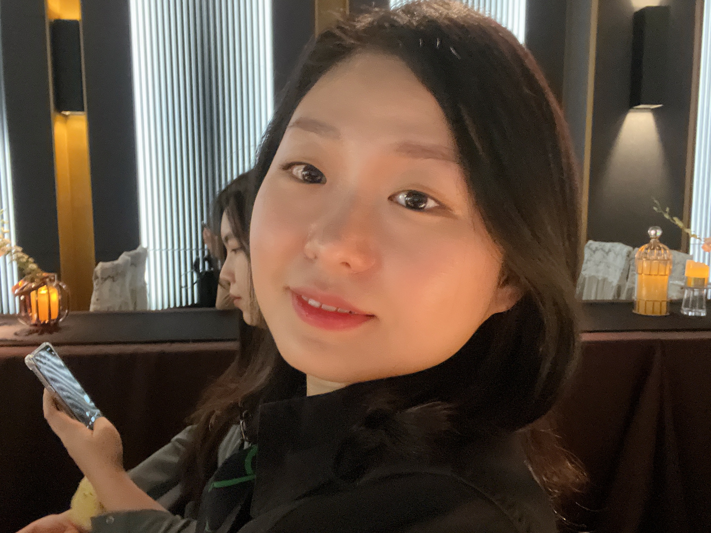

# 저를 소개합니다!

## 이름

김지명 

한자로 뜻 지(志)자에 밝을 명(明)자를 사용하여 '뜻이 밝은 아이'라는 의미를 담아 부모님이 지어주신 이름입니다. 
이름의 뜻에 힘입어 명확한 주관을 가지고 주변을 밝혀주는 프론트엔드 개발자가 되고 싶습니다. :)

## 나이

9n년생 (아슬아슬하게 MZ세대)

## 취미

취미 부자인 저는 여러가지의 취미를 가지고 있습니다.

1. 수영 
   물 공포증이 있던 제가, 여름 휴가 때 즐겁게 물놀이 하는 모습을 구경만 할 수 없어서 시작하게된 수영!  지금 막 자유형을 습득한 수린이 랍니다.

2. 러닝 
   나이가 들어갈수록 같은 양을 먹어도 살이 찌는 슬픈 현실을 마주한 후
   다이어트 목적으로 시작했습니다.  꾸준히 달릴수록 체력이 늘어감을 몸소 느낍니다.

3. 독서 
   세상에는 참 다양한 사람들이 존재합니다. 때로는 저와 다른 시각에서 문제를 바라보는 것도  나라는 하나의 세계를 넓혀가는데 큰 도움이 되고, 이해와 공감의 폭이 넓어질수록 타인을 수용할 수 있는 여유가 생기는 것 같습니다. 
   그런 의미에서 독서는 언제나 제게 영감을 줍니다.

4. 전시회 관람 
   한 때 화가를 꿈꾸는 미술학도였던 저는 미술 전시회를 보러다니는 것도 매우 좋아합니다. 
   감수성이 예민한 편인데 예술가들의 노트를 읽으며 '이 세상에 나와 같은 사람이 또 있구나' 라는 생각이 들면서 마음에 큰 위로를 받습니다.

## 좋아하는 음식

한식, 양식, 중식, 일식 가리지 않고 좋아하는 편이지만, 
가장 좋아하는 음식은 회와 스시입니다! 

## 좋아하는 동물

고양이 사랑해요.

## 마무리

멋쟁이사자 프론트엔드 스쿨 12기를 시작한지 이제 막 일주일 밖에 되지 않았지만 
너무나 많은 것들을 배우고 있어서 강사님께 감사한 마음 뿐입니다. 
게다가 좋은 동기들을 만난 것 같아서 앞으로의 느낌이 좋습니다! 
부족한 점은 유연한 태도로 고쳐나가며 언제나 발전하는 사람이 되겠습니다. 
저의 소개를 끝까지 읽어주셔서 감사합니다. :) 
