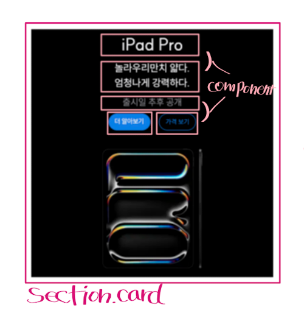

# 4차 과제 - apple 제품 카드

🔗 <a href="https://jimyeong21.github.io/homework/apple/apple.html" target="_blank">apple.html 바로가기</a>

## 레이아웃 설계

<p style="text-align:center;">
  
</p>

- Grid 로 레이아웃을 구현해야 하는 것이 과제 조건이었기에 대략적인 구현방법을 그려보았습니다.
- 1024 미만의 사이즈를 우선적으로 설계한 후 1024 이상의 사이즈에 속성을 재설정하는 방법을 택했습니다.
- 1024 미만에서는 grid-template-colunms: minmax(320px, 1fr) 속성을 추가하여 최소 사이즈를 정해놓았습니다.
- 1024 이상에서는 미디어 쿼리를 사용하여 grid-template-colunms: repeat(2, 1fr) 으로 재설정 하였습니다.
- 열의 갯수는 뷰포트 사이즈에 따라 유동적으로 설정될 수 있게끔 grid-template-row: 1fr 을 기본 속성으로 주었습니다.

## 컴포넌트 나누기

<p style="text-align:center;">
  
</p>

- 카드 전체를 하나의 컴포넌트로 봐야 하는지, 아니면 카드 내부의 요소들만 컴포넌트로 봐야할지 고민을 많이 했습니다.
- section.card 는 Grid items 로서의 역할을 해야하고 card 내부의 레이아웃은 유동적으로 변경될 수도 있지 않을까라고 생각한 후 내부의 텍스트와 버튼 요소들을 컴포넌트 요소로 정했습니다.
- 여전히 컴포넌트를 나누는 방법을 정하는 것은 아직 어려운 것 같습니다.

## 제품이미지 배경 설정하기

```css
&:nth-child(1) {
  background-image: image-set(url(./../products/ipad_pro.webp) 1x, url(./../products/ipad_pro_2x.webp) 2x);
}
&:nth-child(2) {
  background-image: image-set(url(./../products/ipad_air.webp) 1x, url(./../products/ipad_air_2x.webp) 2x);
}
/* 이하 생략 */
```

- 우선 이미지 성능 최적화를 위해 jpeg파일을 모두 webp 확장자 형식의 파일로 변경했습니다.
- 과제의 조건 중 하나는 디바이스의 픽셀 밀도에 따라 1배율 또는 2배율 이미지가 반영되도록 하는 것이었습니다.
- [mdn : image-set 속성](https://developer.mozilla.org/ko/docs/Web/CSS/image/image-set)
- 위 링크를 참조하여 배경이미지로 설정하였습니다.

## 구현 결과

<p style="text-align:center;">
  
</p>

## 과제를 마무리 하며

- CSS 변수를 재할당 하기 위한 변수 이름을 정하기가 어렵다고 생각되었습니다.
- class 네이밍 역시도 어떤 이름이 적절할지, --는 언제 쓰는게 맞는지 아직은 헷갈립니다.
- 처음 그리드에 대한 수업을 들었을땐 익숙하지가 않아서 이게 뭘까 싶었는데,<br />
  회고조에서 그리드 예제를 구현해본 경험과 더불어 이번 과제를 만들면서 이제는 Grid의 개념이 어느정도 가닥이 잡힌 것 같습니다.
- 아직 능숙하게 Grid를 다룰 수 있는 것은 아니지만 처음 멘붕이었을 때와 달리 비교적 많이 발전한 제 자신을 보며 뿌듯함을 느꼈습니다.
