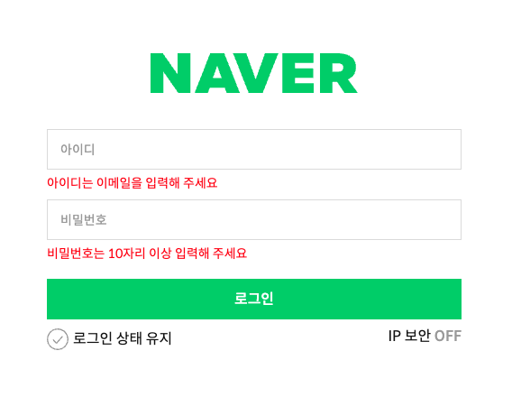
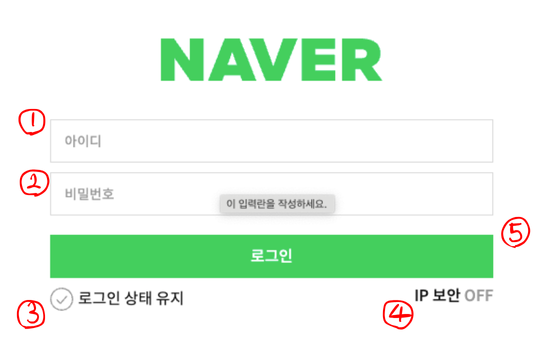

# 3차 과제 - 네이버 로그인 폼

🔗 <a href="https://jimyeong21.github.io/homework/login/login.html" target="_blank">login.html 바로가기</a>

## 과제를 수행하기에 앞서 중점으로 둔 것들

1. 신뢰할 수 있을만한 사이트에서 레퍼런스를 찾아볼 것. (mdn, whatwg, w3c 등)
2. 마크업은 컴포넌트 단위로 설계해보려고 노력할 것.
3. 준수한 웹접근성을 구현할 것.
4. css 네이밍 규칙은 BEM 패턴으로 할 것.

과제를 진행하기 전 대략적으로 위와 같이 기준을 세웠습니다.<br />
기본적이라고 생각되어지는 것들을 다시 되새겨본 이유는 단지 보여지는 것을 완성하기 위한 결과물이 되고싶지 않았기 때문입니다.

## 회원정보 입력 폼 마크업

```html
<form action="/" class="login-form">
  <ul class="login-list">
    <li class="login-list__item">
      <div class="user-info">
        <label for="user-id" class="sr-only">아이디</label>
        <input class="user-info__input" id="user-id" name="user-id" type="email" placeholder="아이디" required />
        <span class="user-info__validation">아이디는 이메일을 입력해 주세요</span>
      </div>
    </li>
    <li class="login-list__item">
      <div class="user-info">
        <label for="user-password" class="sr-only">비밀번호</label>
        <input class="user-info__input" id="user-password" name="user-password" type="password" minlength="10" placeholder="비밀번호" required />
        <span class="user-info__validation">비밀번호는 10자리 이상 입력해 주세요</span>
      </div>
    </li>
  </ul>
  <!-- 이하생략 -->
</form>
```

- 회원정보 입력 폼 마크업의 구조는 위와 같이 설계하였습니다.
- 스크린 리더기가 화면을 읽을 때 목록(ul)요소는 몇가지 리스트(li)가 있다고 사전고지를 한다고 알고있습니다.<br />
- 이를 활용하면 로그인을 할 때 사용자의 인지성(?)이 조금은 나아지지 않을까 하여 ul > li 요소로 기본 구조를 잡았습니다.
- div 태그로 input과 label을 한번 더 감싼 이유는 컴포넌트화를 위해서였습니다.<br />

## Validation Check

<p style="text-align: center;">
  
</p>

- 앞서 말씀드린 원칙대로 우선 mdn 사이트에서 적절한 키워드로 검색을 해보았고 :invalid 선택자가 존재한다는 사실을 알게 되었습니다.
- 그러나 버튼을 클릭 시 유효성 검사 체크가 되게 하고싶었고, 다시 서칭한 결과 :user-invalid 선택자를 찾게 되었습니다! [참조링크](https://developer.mozilla.org/en-US/docs/Web/CSS/:user-invalid)
- :user-invalid와 플러스(+) 선택자를 활용하여 유효성 검사 안내 멘트를 보이게 하였습니다.
- css 코드는 아래와 같습니다.

```css
.user-info {
  /* 생략 */
  .user-info__input {
    /* 생략 */
    & + .user-info__validation {
      display: none;
    }

    &:user-invalid + .user-info__validation {
      display: block;
      margin-top: 0.4375rem;
      margin-block-start: 0.4375rem;
      font-size: var(--font-size-14);
      color: var(--color-red);
    }
  }
}
```

## IP 보안 값 바꾸기 & 새창열기

```html
<div class="login-ip">
  <label for="ip-security" class="login-ip__label">IP 보안</label>
  <button type="button" onclick="ipSwitch(), window.open('./pages/ip_security.html')" aria-pressed="false" id="ip-security" class="login-ip__button">
    <span class="switch off">OFF</span>
    <span class="switch on">ON</span>
  </button>
</div>
```

- 이번 과제를 진행하며 가장 고민을 많이한 부분입니다.<br />
- input type="checkbox"를 사용하여 OFF -> ON으로 텍스트를 바꿀 수도 있었지만, <br />
  링크로 새 창 띄우기를 해야했기에 a태그와 check박스를 어떻게 엮어야 할 지 감이 오질 않았습니다.
- 또 다시 끝없는 서칭을 한 결과, button 태그에 aria-pressed 라는 속성을 주면 토글방식으로 버튼이 동작한다는걸 알게되었습니다.
- 그러나 문제는 어떻게 aria-pressed 의 값을 true와 false로 바꾸는가 였습니다.

```js
function ipSwitch() {
  let el = document.getElementById("ip-security");
  el.ariaPressed = "true";
}
```

- [참조링크 : js로 aria-pressed 의 값 바꾸기](https://developer.mozilla.org/en-US/docs/Web/API/Element/ariaPressed)
- 아무리 찾아보아도 css만으로 컨트롤을 시킬 수 있는 방법은 없는 것 같았습니다.
- 그래서 문서를 참조하여 간단한 js 문법으로 button 에 onclick 이벤트를 걸어주는 방법을 택했습니다.
- javascript를 사용하면 안되는 미션이었다면, 저는 초기에 잘못된 접근을 한 것이리라 생각됩니다.

## 아쉬운 점

> 1. 키보드 접근 순서 변경

과제의 조건 중 하나는 키보드로도 폼 서식을 접근할 수 있게 하는 것이었습니다.<br />
탭키로 조작하면 키보드 접근이 가능했지만, 저는 아래의 그림처럼 탭순서를 변경하고 싶었습니다.

<p style="text-align: center;">
  
</p>  
  - 아이디 -> 비밀번호 -> 로그인 상태 유지 -> IP 보안 -> 로그인
  - 이렇게 로그인을 제일 마지막으로 키보드가 접근 할 수 있게 하고 싶었지만 구현하지 못했습니다.
  - 제가 알고 있는 헤결 방법은,<br />
  첫번째, 마크업 구조를 적절하게 변경한다. <br />
  두번째, tabindex="숫자" 속성을 이용하여 순서를 제어한다. <br />
  이렇게 두가지 입니다. 그러나 웬만하면 tabindex의 값은 0 또는 -1 로만 유지하는 것이 좋다고 하는 의견을 따라서 사용하지 않았습니다.

> 2. IP 보안 접근 방식

- 이 부분은 명확한 답을 몰라서 더욱 답답한 것 같습니다.
- 얼른 선생님께서 풀어주시는 예시를 보고싶습니다. ㅠㅠ

## 마무리

- 처음 과제에 대한 설명을 들었을 때 막막하기 그지없었는데 그래도 하나씩 차근차근 완성해나가며 재미를 느꼈습니다.
- 컬러나 폰트사이즈 같은 경우 CSS 변수로 처리했는데 어디까지 활용하는 것이 좋은가에 대한 고민도 해보았습니다. 이 부분은 컴포넌트화에 대한 고민과도 연결지점이 있는 것 같습니다.
- 업데이트된 기술은 어서 빨리 모든 브라우저에서 범용적으로 사용할 수 있게 지원해줬으면 좋겠다는 바람도 생겼습니다. 작업자 입장에서 너무나 편리한 점이 많았기 때문입니다.
- 수업시간에 분명히 설명을 들었는데 애매하게 알고 있어서 명확하게 집고 넘어가야할 부분도 꽤 많이 보였습니다. <br /> 저만의 노트를 만들어서 정리해야겠다고 생각했습니다.
